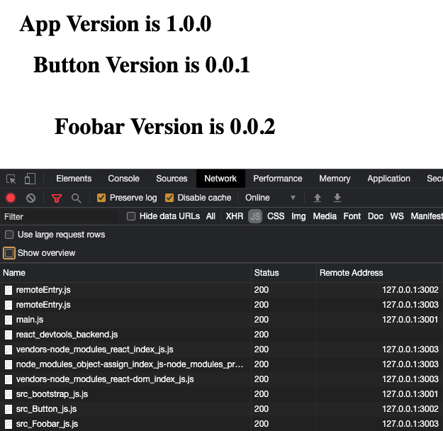

# Webpack 5 Module Federation with React

This example shows a basic host application loading remote components

## Running Demo

Run `yarn bootstrap` and `yarn start`.

This will build and serve the apps on ports 3001, 3002, 3002.

- [localhost:3001](http://localhost:3001/) (main app, will import `button` and `foobar`)
- [localhost:3002](http://localhost:3002/) (exposes `button`)
- [localhost:3002](http://localhost:3002/) (exposes `foobar`)

### Screenshot

(note the code for button and foobar coming from a different port)

